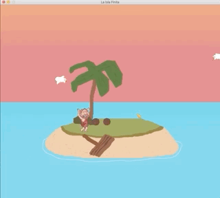

# PyWeek30-La-Isla-Finita
PyWeek30 competition entry. 




### What dependencies your game requires to run
Game uses arcade python library as a core. I used pathlib to make game cross-platform.
Numpy to calculate degree between horizon and mouse coordinates. Pymunk for cocos physic.
Checkout requirements.txt for details.

###How to build and run your game
Simply just fulfill requirements by
```
pip install -r requirements.txt
```
Then run the game
```
python run_game.py
```
To change screen resolution or sound settings, go to:
```
data/settings.ini
```

###The controls
A(LEFT) - LEFT \
D(RIGHT) - RIGHT \
W(UP) - GO TO ISLAND \
S(DOWN) - GO TO RIFT \
MOUSE - AIM AND SHOOT

*alternative keys in brackets

###What there is to see in the game
For now it's just a simple-enemy, simple-goal game. You have to build a rift, but seagulls don't
like our player. I hope I will add more enemies and fix few things after pyWeek. I had real good
time during this week.

###Copyright attributions (eg. CC-BY resources you have used)
I included all sources of external media into credits.txt files. I used:
```
Files: ui_button_png, ui_button_hover.png
License: CC0 1.0 Universal
Source: https://www.kenney.nl/assets/ui-pack
```

```
File: track01.mp3
Title: adrift
Author: airtone
License: Licensed under Creative Commons Attribution Noncommercial (3.0)
Source: http://ccmixter.org/files/airtone/62216

File: track02.mp3
Title: Northern Lullaby
Author: Sergey Cheremisinov
License: Licensed under Creative Commons Attribution Noncommercial (4.0) International (CC BY-NC 4.0)
Source: https://freemusicarchive.org/music/Sergey_Cheremisinov/The_Healing/Northern_Lullaby
```